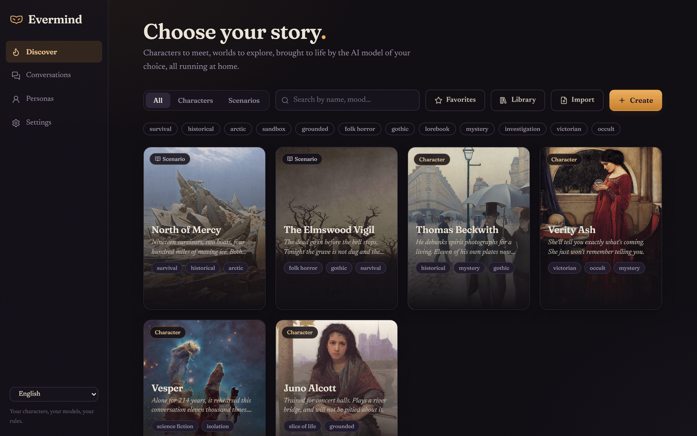
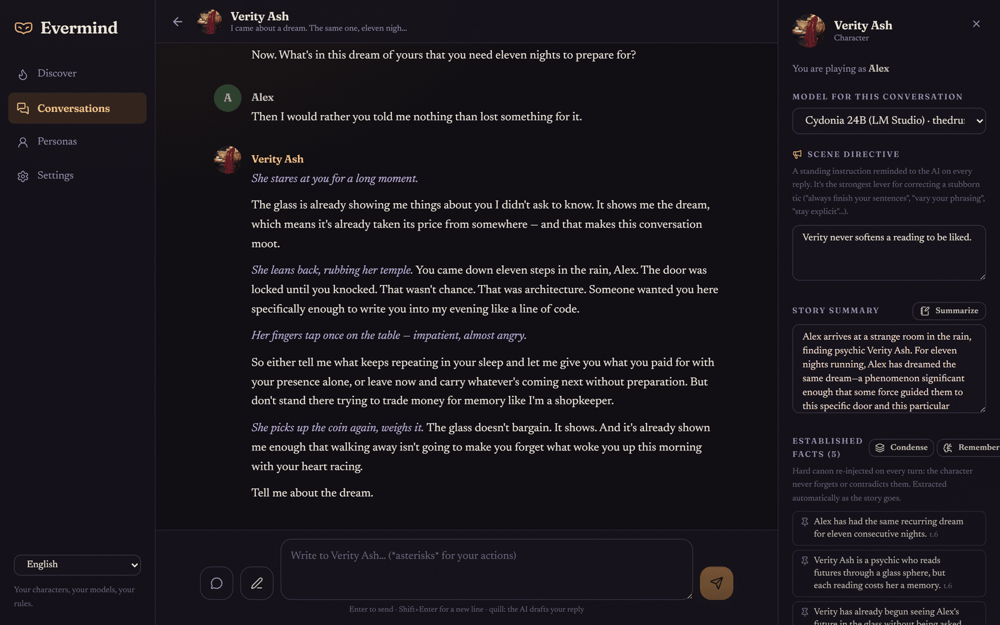
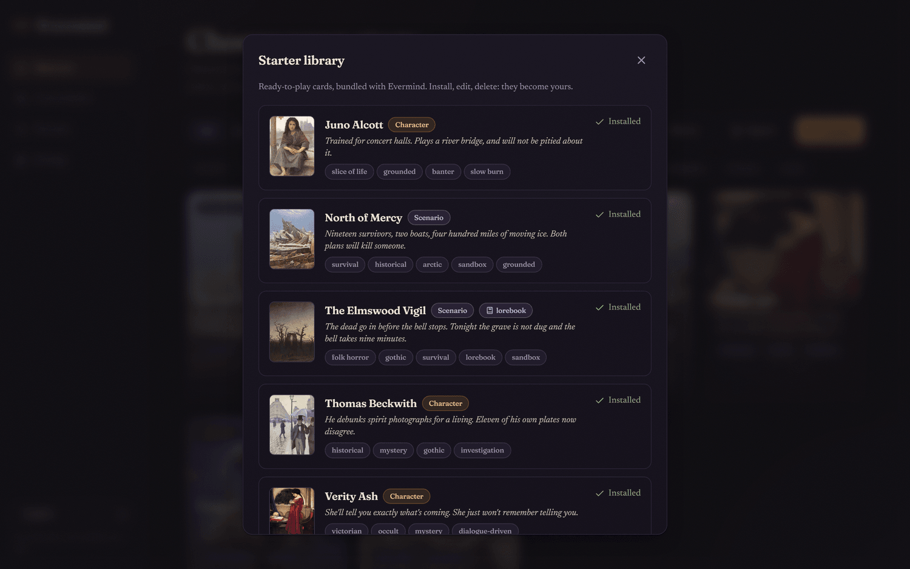
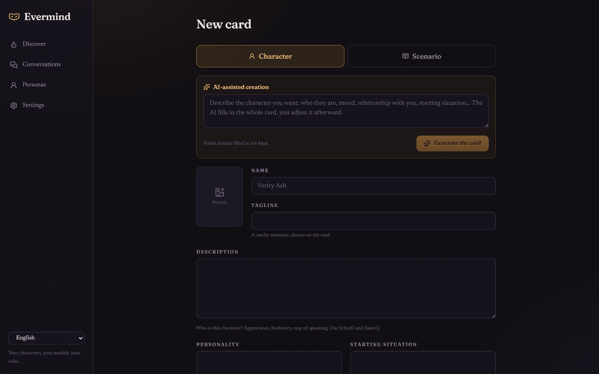
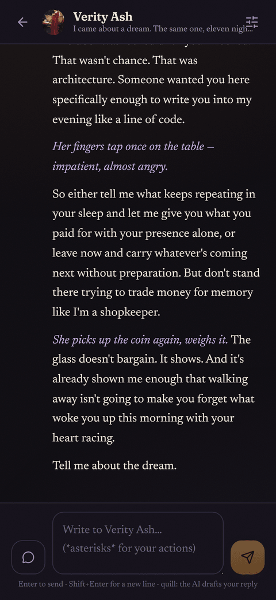

# Evermind

### Immersive AI roleplay, on your own machine.

**Your characters. Your model. Your rules.**

[**Get started**](INSTALL.md) &nbsp;·&nbsp; [A look around](#a-look-around) &nbsp;·&nbsp; [What makes it different](#what-makes-it-different) &nbsp;·&nbsp; [Licence](LICENSE)

 

 

Evermind is for writing stories with characters that answer back properly. You
pick someone to talk to, or a world to walk into, and it takes it from there.
There is no meter running and nobody vetting what you write. None of it sits on
anyone else's server.

I built it because the hosted platforms kept deciding what my characters were
allowed to say, and because every one of them eventually forgot what the story
had already established. The rest of this grew out of trying to fix those two
things properly.

It is free and open source, and it stays yours.

 

---

 

## What makes it different

<table>
<tr>
<td width="33%" valign="top">

### You choose the mind

Evermind ships without an AI inside it. You plug in whichever one you like,
either a model running on your own computer or an online service you already pay
for. Swap models whenever you feel like it and the story carries over.

</td>
<td width="33%" valign="top">

### Nobody writes your rules

There is no content policy, no moderation layer and no ethical filter sitting
between you and the model. Nothing gets censored or softened on your behalf. The
only limits anywhere in the system are the ones you set yourself, plus whatever
your chosen model happens to bring with it.

</td>
<td width="33%" valign="top">

### It stays on your machine

Your characters, conversations and API keys all sit in one folder on your own
computer. Run the model locally as well and nothing you write ever leaves the
machine at all.

</td>
</tr>
</table>

 

---

 

## It actually remembers

Most roleplay tools forget. Two or three hundred messages in, the character
starts contradicting itself, forgiving things it has no reason to forgive, and
recycling its own phrasing back at you.

Evermind keeps a running memory of the story instead. While you play, it writes
down what actually happened: the promise made in chapter two, the wound that
never properly healed, who stopped trusting whom and why. All of that goes back
to the model on every single reply, so a character will not quietly forget the
worst thing you ever did to it.

None of it is hidden from you either. That panel on the right is the memory
itself. You can edit any line of it, pin the ones that must never be dropped, or
throw out the rest.

 

> Characters here are not built to please you. Offer a flower after a betrayal
> and it lands as exactly that: a flower, after a betrayal. Trust takes a long
> time to rebuild, and a character will hold a position you would much rather it
> dropped.

 

---

 

## Ready the moment you install it

Six characters and worlds come with Evermind, written for it rather than borrowed
from anywhere. Install one and it belongs to you, to edit or break as you please.

There is a seer whose readings are always true and cost her one of her own
memories every time. A violinist who will take payment but not pity. A
photographer in 1877 who debunks spirit photographs for a living, until his own
plates start disagreeing with him. A ship's mind that has been alone for two
hundred years and has had rather too much time to think about it. Then two worlds
instead of people: a village that has to get its dead into the ground before the
bell stops ringing, and nineteen survivors on the Arctic ice choosing between two
plans that will each kill somebody.

 

---

 

## Or write your own

Fill in as much or as little as you want. If you would rather not stare at a
blank form, describe the character in a sentence and let your own model draft the
card for you to correct.

Cards use the standard Character Card V2 format, so the thousands already shared
around the community work here, and anything you build can be taken elsewhere.

 

---

 

## A look around

<table>
<tr>
<td width="60%" valign="top">

Written like prose, streamed as it comes

</td>
<td width="40%" valign="top" align="center">

And from the sofa, on your phone

</td>
</tr>
</table>

Other things you get along the way. Swipe for a different take on any reply, or
branch the story at a message and keep both versions running. Rewind and rewrite
anything you like. When you have no idea what your own character would say, the
app will draft the line for you to edit. Lorebook entries stay out of the way
until something in the scene mentions them. The interface is in English, French,
German and Spanish.

 

---

 

## Get started

About twenty minutes, and no coding involved.

### [Read the installation guide](INSTALL.md)

Windows, macOS and Linux &nbsp;·&nbsp; run the AI locally or plug in a service &nbsp;·&nbsp; Docker or plain scripts

 

---

 

## What is coming

Group scenes with more than one character in them. A proper relationship model,
so that trust and resentment carry weight of their own. Generated portraits and
voice, eventually. Possibly somewhere to share cards, if people turn out to want
one.

Contributions are welcome. If you are here to work on the code,
[start here](docs/DEVELOPING.md).

 

## Licence

[AGPL-3.0-or-later](LICENSE). Host it, modify it and redistribute it freely. Any
modified version you distribute, or expose as a network service, has to stay open
source under the same licence.

 

Evermind does not decide what you are allowed to write. That was rather the point of building it.

