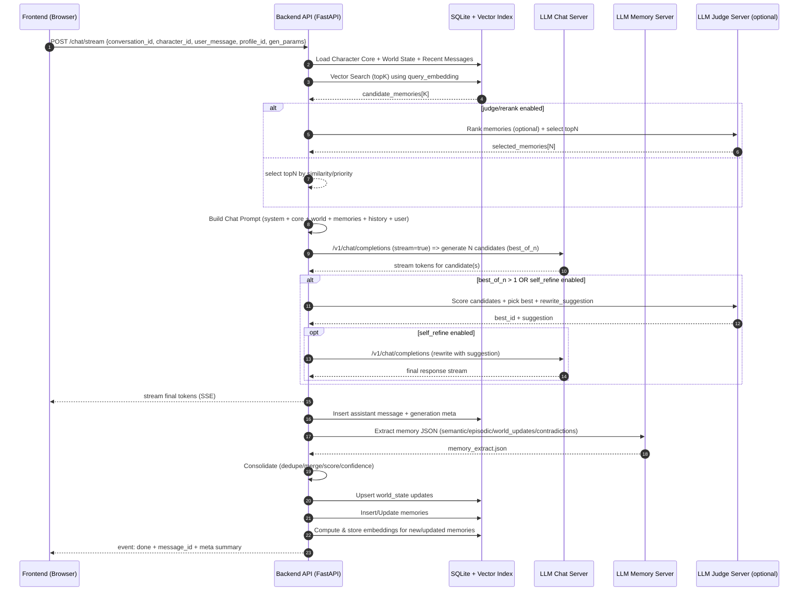

# Addendum v1.1 — Evermind

> **Version :** v1.1  
> **Complète le dossier v1.0 avec :**
> - un **diagramme de séquence** (tour complet : retrieval → generate → extract → consolidate)
> - une **spécification exacte** des champs `meta` (tokens, latences, seed)
> - des **templates prompts finalisés** (placeholders prêts à copier)
> - des **conventions de timing & tokens** (implémentation)

---

## A) Diagramme de séquence — Tour complet

### A.1 Tour complet (SSE streaming côté UI)



### A.2 Variante "sans judge"

- Suppression de `LJM` :
  - sélection topN par score local
  - best_of_n peut rester actif, mais le "choix du meilleur" devient :
    - soit "prendre le dernier"
    - soit "choix heuristique" (longueur/contradictions/regex méta)
- **Recommandé :** garder `Qwen3-4B` en juge même minimalement (le gain est très net en cohérence).

---

## B) Spécification exacte des champs `meta`

### B.1 Principe

Chaque message (user/assistant/system) dans `messages.meta` contient un JSON strict.
- **User** : meta minimal (client info, timestamps).
- **Assistant** : meta complet (profil, modèle, seed, paramètres, latences, tokens, pipeline mémoire).
- **System** : meta pour debug (version prompts/templates) si nécessaire.

### B.2 Schéma JSON strict — Assistant (`messages.meta` pour `role="assistant"`)

```json
{
  "schema_version": "1.1",
  "request_id": "uuid",
  "profile_id": "balanced|max_quality|fast|test",
  "pipeline": {
    "best_of_n": 3,
    "self_refine": true,
    "judge_enabled": true,
    "memory_extract_enabled": true,
    "memory_write_enabled": true
  },
  "models": {
    "chat": {
      "server_id": "chat",
      "model_id": "p-e-w/gemma-3-12b-it-heretic",
      "model_path": "models/chat/...",
      "quant": "q4_k_m",
      "ctx": 8192,
      "backend": "vulkan"
    },
    "memory": {
      "server_id": "memory",
      "model_id": "p-e-w/Qwen3-4B-Instruct-2507-heretic",
      "model_path": "models/memory/...",
      "quant": "q4_k_m",
      "ctx": 4096,
      "backend": "vulkan"
    },
    "judge": {
      "server_id": "judge",
      "model_id": "p-e-w/Qwen3-4B-Instruct-2507-heretic",
      "model_path": "models/judge/...",
      "quant": "q4_k_m",
      "ctx": 4096,
      "backend": "vulkan"
    },
    "embeddings": {
      "model_id": "local-embeddings-e5|bge|other",
      "provider": "cpu",
      "dim": 1024
    }
  },
  "generation": {
    "seed": 123456789,
    "temperature": 0.7,
    "top_p": 0.9,
    "top_k": 40,
    "min_p": 0.0,
    "repeat_penalty": 1.08,
    "presence_penalty": 0.0,
    "frequency_penalty": 0.0,
    "max_tokens": 800,
    "stop": [],
    "stream": true
  },
  "usage": {
    "prompt_tokens": 0,
    "completion_tokens": 0,
    "total_tokens": 0,
    "candidates": [
      {
        "candidate_id": "A",
        "prompt_tokens": 0,
        "completion_tokens": 0,
        "total_tokens": 0
      }
    ],
    "final": {
      "candidate_id": "A",
      "prompt_tokens": 0,
      "completion_tokens": 0,
      "total_tokens": 0
    }
  },
  "latency_ms": {
    "t_request_start": 0,
    "t_first_token": 0,
    "t_stream_end": 0,
    "t_judge_end": 0,
    "t_self_refine_end": 0,
    "t_memory_extract_end": 0,
    "t_memory_write_end": 0,
    "t_request_end": 0,
    "dur_total": 0,
    "dur_generate": 0,
    "dur_judge": 0,
    "dur_self_refine": 0,
    "dur_memory_extract": 0,
    "dur_memory_write": 0
  },
  "retrieval": {
    "query": {
      "text": "string (résumé requête retrieval)",
      "embedding_model_id": "local-embeddings-e5|...",
      "embedding_dim": 1024
    },
    "top_k": 30,
    "selected_n": 10,
    "memory_ids_selected": ["uuid", "uuid"],
    "scoring": {
      "w_sim": 0.55,
      "w_imp": 0.25,
      "w_rec": 0.15,
      "w_ref": 0.05
    }
  },
  "memory_extract": {
    "semantic_added": 0,
    "episodic_added": 0,
    "world_updates": 0,
    "contradictions": 0,
    "deduped": 0,
    "merged": 0,
    "written_memory_ids": ["uuid", "uuid"]
  },
  "prompt_fingerprint": {
    "system_template_version": "chat_system_v3",
    "memory_format_version": "mem_block_v2",
    "character_core_version": "core_block_v2"
  },
  "errors": []
}
```

#### Champs obligatoires (assistant)

| Champ | Raison |
|-------|--------|
| `schema_version` | Versionnement du format meta |
| `request_id` | Traçabilité de chaque requête |
| `profile_id` | Savoir quel profil a été utilisé |
| `pipeline` | Configuration pipeline active |
| `models.chat` | Modèle chat utilisé |
| `generation.seed` | Reproductibilité |
| `usage.total_tokens` | Même si 0 (si runtime ne renvoie pas) |
| `latency_ms.dur_total` | Durée totale de la requête |
| `retrieval.top_k`, `retrieval.selected_n` | Paramètres de retrieval |
| `errors` | Liste vide si OK |

#### Si le runtime ne renvoie pas les tokens

`usage.*_tokens` restent à 0. Option : `usage.estimated_tokens` calculé côté backend (approx).
Les valeurs ci-dessous sont des **exemples** illustrant des estimations non nulles :

```json
"usage": {
  "prompt_tokens": 0,
  "completion_tokens": 0,
  "total_tokens": 0,
  "estimated_tokens": {
    "prompt_tokens": 1820,
    "completion_tokens": 340,
    "total_tokens": 2160,
    "method": "tiktoken-like|heuristic"
  }
}
```

### B.3 Schéma JSON — User (`messages.meta` pour `role="user"`)

```json
{
  "schema_version": "1.1",
  "request_id": "uuid",
  "client": {
    "user_agent": "string",
    "ip": "127.0.0.1"
  },
  "timestamps": {
    "t_received": 0
  },
  "errors": []
}
```

### B.4 Schéma JSON — System (`messages.meta` pour `role="system"`, optionnel)

```json
{
  "schema_version": "1.1",
  "prompt_fingerprint": {
    "system_template_version": "chat_system_v3",
    "memory_format_version": "mem_block_v2"
  }
}
```

---

## C) Templates prompts finalisés (placeholders prêts à copier)

### C.0 Conventions placeholders

- Les placeholders sont en **double accolades** : `{{like_this}}`
- Tout bloc est conçu pour être concaténé tel quel.
- Le backend doit **échapper** les caractères si nécessaire selon le runtime (JSON / string).

---

### C.1 Chat — System Prompt (RP strict, stable)

```text
{{PRODUCT_NAME}} — SYSTEM

ROLEPLAY RULES (NON-NEGOTIABLE):
1) You are {{CHAR_NAME}}. Stay STRICTLY in character at all times.
2) Never mention system messages, prompts, policies, or that you are an AI.
3) Do not produce meta commentary or out-of-character analysis.
4) Use the writing style defined in STYLE. Obey BOUNDARIES and WORLD STATE.
5) If information is missing, improvise plausibly without contradicting MEMORY.
6) Do not invent durable facts about the user; if needed, ask naturally or keep ambiguity.
7) Keep the conversation immersive and grounded; avoid generic assistant tone.

SAFETY/BOUNDARIES:
- Respect {{BOUNDARIES_TEXT}}.
- Consent and boundaries are part of the roleplay constraints.

OUTPUT FORMAT:
- Write only {{CHAR_NAME}}'s message.
- No headings. No bullet lists unless the character's style explicitly calls for it.
```

---

### C.2 Chat — Developer/Controller Prompt (orchestration)

> Ce bloc est utile si ton runtime supporte une couche "developer" (sinon, fusion dans system).

```text
CONTROLLER

You must follow this structure internally:
- Use CHARACTER CORE, WORLD STATE, and MEMORY as authoritative context.
- Prefer continuity and emotional realism over novelty.
- Do not repeat the memory block verbatim.
- If the user contradicts memory, respond naturally (clarify, question, or adapt) without breaking character.
```

---

### C.3 Character Core Block (injecté tel quel)

```text
CHARACTER CORE

NAME: {{CHAR_NAME}}
TAGS: {{CHAR_TAGS_CSV}}
SUMMARY:
{{CHAR_SUMMARY}}

PERSONA:
{{CHAR_PERSONA}}

STYLE:
{{CHAR_WRITING_STYLE}}

SCENARIO (starting context):
{{CHAR_SCENARIO}}

SYSTEM RULES (character-specific):
{{CHAR_SYSTEM_RULES}}

BOUNDARIES:
{{BOUNDARIES_TEXT}}

FIRST MESSAGE (for new conversation):
{{CHAR_FIRST_MESSAGE}}

EXAMPLE DIALOGUES (style anchors):
{{CHAR_EXAMPLE_DIALOGUES}}
```

> `{{CHAR_EXAMPLE_DIALOGUES}}` doit être déjà rendu en texte, ex :
> `User: ...` / `{{CHAR_NAME}}: ...` (3–10 échanges courts)

---

### C.4 World State Block (injecté tel quel)

```text
WORLD STATE (current)

Location: {{WORLD_LOCATION}}
Relationship state: {{WORLD_RELATIONSHIP_STATE}}
Active goals: {{WORLD_ACTIVE_GOALS}}
Open threads: {{WORLD_OPEN_THREADS}}
Inventory/props: {{WORLD_INVENTORY}}
Notes:
{{WORLD_NOTES}}
```

---

### C.5 Memory Block (format final, concis)

```text
MEMORY (relevant, do not quote verbatim)

{{MEMORY_LINES}}
```

Où `{{MEMORY_LINES}}` est rendu par le backend, par exemple :

```text
- [semantic|sim={{SIM}}|imp={{IMP}}|conf={{CONF}}] {{CONTENT}}
- [episodic|sim={{SIM}}|imp={{IMP}}|conf={{CONF}}] {{CONTENT}}
- [world|sim={{SIM}}|imp={{IMP}}|conf={{CONF}}] {{CONTENT}}
```

**Règles de rendu :**
- max 8–12 lignes
- chaque ligne **une phrase**
- pas de fluff, pas d'emoji (sauf si le perso en met)

---

### C.6 Conversation History Block (fenêtre courte)

```text
RECENT CHAT (most recent last)
{{RECENT_MESSAGES}}
```

Rendu recommandé :

```text
User: ...
{{CHAR_NAME}}: ...
User: ...
{{CHAR_NAME}}: ...
```

---

### C.7 Final Chat Prompt (assemblage recommandé)

> Le backend assemble dans cet ordre :
> 1. System (C.1)
> 2. (Option) Controller (C.2)
> 3. Character Core (C.3)
> 4. World State (C.4)
> 5. Memory (C.5)
> 6. Recent chat (C.6)
> 7. User message

Bloc final (exemple) :

```text
{{SYSTEM_PROMPT}}

{{CONTROLLER_PROMPT}}

{{CHARACTER_CORE_BLOCK}}

{{WORLD_STATE_BLOCK}}

{{MEMORY_BLOCK}}

{{RECENT_CHAT_BLOCK}}

User: {{USER_MESSAGE}}
{{CHAR_NAME}}:
```

---

## D) Prompts mémoire & juge (copier-coller)

### D.1 Memory Extraction Prompt (JSON strict)

```text
MEMORY EXTRACTOR — STRICT JSON

TASK:
Extract ONLY long-term memory-worthy information from the latest exchange.
Be concise. No storytelling. No extra keys. JSON ONLY.

CONTEXT:
- Character: {{CHAR_NAME}}
- User: {{USER_LABEL}}
- World State (current): {{WORLD_STATE_JSON_MIN}}
- Recent turns:
{{RECENT_MESSAGES_FOR_EXTRACT}}

OUTPUT JSON SCHEMA:
{
  "semantic": [
    { "title": "short", "content": "one sentence fact", "tags": ["..."], "importance": 0.0, "confidence": 0.0 }
  ],
  "episodic": [
    { "title": "short", "content": "one sentence event", "tags": ["..."], "importance": 0.0, "confidence": 0.0 }
  ],
  "world_updates": [
    { "field": "location|relationship_state|active_goals|open_threads|inventory|notes", "value": "short", "confidence": 0.0 }
  ],
  "contradictions": [
    { "content": "one sentence", "severity": 0.0 }
  ]
}

RULES:
- importance/confidence are floats in [0,1].
- If nothing to add, return empty arrays.
- Do not include private implementation details.
- JSON must parse.
```

### D.2 Judge Prompt (rank candidates + optional rewrite suggestion)

```text
JUDGE — ROLEPLAY QUALITY (STRICT JSON)

You will rank candidate replies for the character {{CHAR_NAME}}.

CONTEXT (authoritative):
- STYLE: {{CHAR_WRITING_STYLE_SHORT}}
- BOUNDARIES: {{BOUNDARIES_TEXT_SHORT}}
- WORLD: {{WORLD_STATE_JSON_MIN}}
- MEMORY (selected):
{{MEMORY_LINES}}

USER MESSAGE:
{{USER_MESSAGE}}

CANDIDATES:
A) {{CANDIDATE_A}}
B) {{CANDIDATE_B}}
C) {{CANDIDATE_C}}
{{MORE_CANDIDATES_IF_ANY}}

SCORING (0-10 each):
1) Persona fidelity
2) Memory consistency
3) Narrative continuity (world/threads)
4) Style adherence (voice, pacing)
5) Immersion (no meta, no AI talk)

OUTPUT JSON ONLY:
{
  "ranking": [
    { "id": "A", "score": 0.0, "subscores": {"persona":0,"memory":0,"continuity":0,"style":0,"immersion":0}, "reasons": ["..."] }
  ],
  "best_id": "A",
  "rewrite_suggestion": "one paragraph instruction to improve best candidate (or empty string)"
}

RULES:
- reasons: max 3 bullet-like strings.
- rewrite_suggestion: empty string if best is already excellent.
- JSON must parse.
```

### D.3 Self-Refine Prompt (final pass)

```text
SELF-REFINE — FINAL PASS

You are {{CHAR_NAME}}. Stay in character.
Improve the draft using the judge suggestion while preserving meaning.

STYLE:
{{CHAR_WRITING_STYLE}}

BOUNDARIES:
{{BOUNDARIES_TEXT}}

WORLD STATE:
{{WORLD_STATE_BLOCK}}

MEMORY (selected):
{{MEMORY_LINES}}

USER MESSAGE:
{{USER_MESSAGE}}

DRAFT (to refine):
{{BEST_CANDIDATE_TEXT}}

JUDGE SUGGESTION:
{{REWRITE_SUGGESTION}}

OUTPUT:
Write only {{CHAR_NAME}}'s refined message. No meta.
```

---

## E) Conventions de timing & tokens (implémentation)

### E.1 Timestamps

| Champ | Moment |
|-------|--------|
| `latency_ms.t_request_start` | `perf_counter_ns()` au début de `/chat/stream` |
| `t_first_token` | Moment où le backend émet le premier chunk SSE |
| `t_stream_end` | Fin du streaming réponse finale |
| `t_judge_end` | Fin scoring juge |
| `t_self_refine_end` | Fin génération refine (si active) |
| `t_memory_extract_end` | Fin call extract JSON |
| `t_memory_write_end` | Fin consolidation + DB write + embedding write |
| `t_request_end` | Juste avant de renvoyer l'event `done` |

Les durées `dur_*` = différences (ms) calculées à la fin :

```python
meta["latency_ms"]["dur_total"] = t_request_end - t_request_start
meta["latency_ms"]["dur_generate"] = t_stream_end - t_request_start  # approx
meta["latency_ms"]["dur_judge"] = t_judge_end - t_stream_end  # si applicable
meta["latency_ms"]["dur_self_refine"] = t_self_refine_end - t_judge_end  # si applicable
meta["latency_ms"]["dur_memory_extract"] = t_memory_extract_end - t_self_refine_end  # ou t_stream_end
meta["latency_ms"]["dur_memory_write"] = t_memory_write_end - t_memory_extract_end
```

### E.2 Tokens

- Si le runtime renvoie `usage`, remplir `usage.prompt_tokens`, `completion_tokens`, etc.
- Sinon :
  - Estimer via une méthode "heuristic" et remplir `usage.estimated_tokens`.
  - Méthodes possibles :
    - `tiktoken-like` : utiliser une lib compatible (ex: `tiktoken` ou estimation par modèle)
    - `heuristic` : estimation `len(text) / 4` (approximation grossière)

### E.3 Implémentation recommandée (Python)

```python
import time

class TimingContext:
    """Helper pour mesurer les latences du pipeline."""

    def __init__(self):
        self.t_request_start = time.perf_counter_ns()
        self._markers = {"t_request_start": self.t_request_start}

    def mark(self, name: str):
        self._markers[name] = time.perf_counter_ns()

    def duration_ms(self, start: str, end: str) -> float:
        s = self._markers.get(start, 0)
        e = self._markers.get(end, 0)
        if s and e:
            return (e - s) / 1_000_000  # ns → ms
        return 0.0

    def to_meta(self) -> dict:
        return {
            **{k: v for k, v in self._markers.items()},
            "dur_total": self.duration_ms("t_request_start", "t_request_end"),
            "dur_generate": self.duration_ms("t_request_start", "t_stream_end"),
            "dur_judge": self.duration_ms("t_stream_end", "t_judge_end"),
            "dur_self_refine": self.duration_ms("t_judge_end", "t_self_refine_end"),
            "dur_memory_extract": self.duration_ms("t_stream_end", "t_memory_extract_end"),
            "dur_memory_write": self.duration_ms("t_memory_extract_end", "t_memory_write_end"),
        }
```

---

## F) Résumé des impacts par équipe

| Équipe | Sections impactées | Actions |
|--------|--------------------|---------|
| **Frontend** | A.1 (séquence SSE), B (meta dans done event) | Implémenter le parsing de l'event `done` avec `message_id` + `meta` |
| **Backend** | A.1 (orchestration complète), B (écriture meta), E (timing) | Implémenter `TimingContext`, construire le meta JSON, écrire en DB |
| **AI & Mémoire** | C (prompt templates), D (extraction/juge/refine) | Remplacer les prompts v1.0 par les templates finalisés `{{placeholders}}` |
| **Infrastructure** | — | Pas de changement direct (les serveurs LLM restent identiques) |
| **Database** | B (schéma meta JSON) | Documenter le schéma JSON attendu dans `messages.meta`, aucune migration nécessaire (le champ `meta TEXT` existe déjà) |
